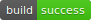

# Limnoria plugin for UrbanDictionary

  

## Introduction

Limnoria plugin for querying [UrbanDictionary](http://www.urbandictionary.com)

_An asynchronous variant of the original UrbanDictionary plugin._

## Install

You will need a working Limnoria bot on Python 3.10 or above for this to work.

Go into your Limnoria plugin dir, usually ~/runbot/plugins and run:

```plaintext
git clone https://github.com/Alcheri/UrbanDictionary.git

```

To install additional requirements, run:

```plaintext
pip install --upgrade -r requirements.txt 
```

Next, load the plugin:

```plaintext
/msg bot load UrbanDictionary
```

## Configuring

* **_supybot.plugins.UrbanDictionary.maxNumberOfDefinitions_**

    Number of definition and examples in output. Max 10.

* **_supybot.plugins.UrbanDictionary.disableANSI_**

    Do not display any ANSI formatting codes in output. Default is _False_

* **_supybot.plugins.UrbanDictionary.enabled_**

    Should plugin work in this channel?

* **_aka add ud urbandictionary $*_**

    Add an alias to your bot for ease of use.

## Example Usage

```plaintext
<spline> @ud spline
<myybot> spline :: The [object] which [Maxis] likes to [reticulate]. Example: 1:  "What [are you] reticulating, dude?"
 2: "[My favorite] dish-- [Splines]!" | A combination organ between [the spine] and the [spleen].
One which doesn't exist, but you should ask [the stoner] people how it's doing anyways.
Example: Hey [Maya], how's your spline doing? What? Not to well? Oh, [I'm sorry] to [hear] that.
```
